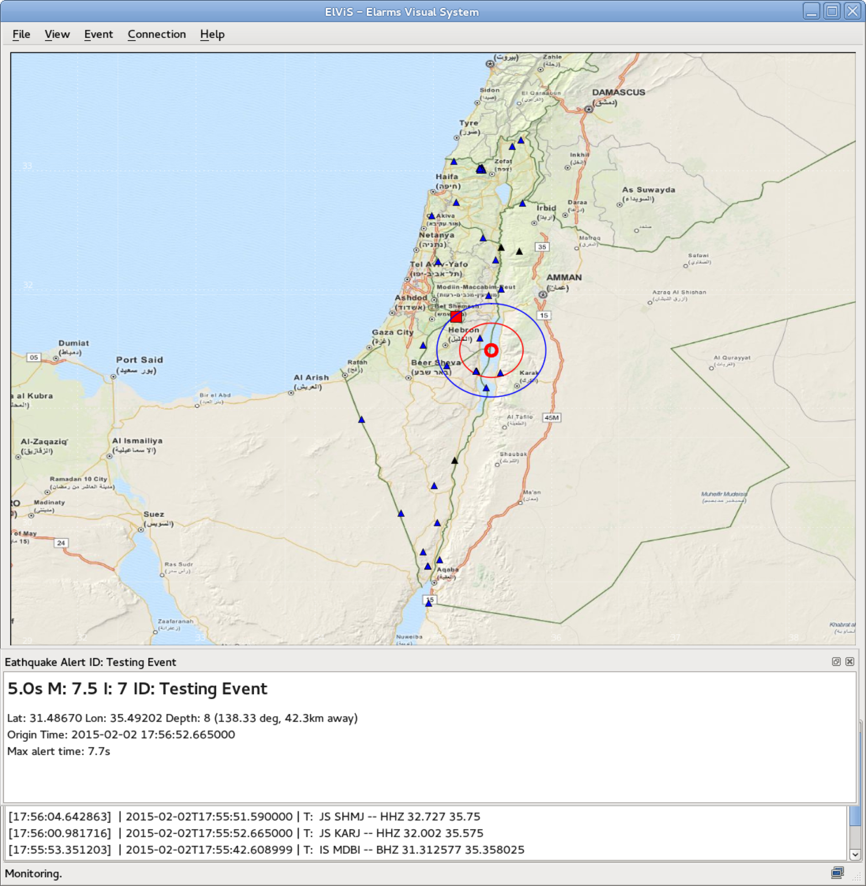

# ElViS - ElarmS Visualization System
### An application for monitoring ElarmS system
Elarms is an Earthquake Early Warning System (EEWS), developed at Berkeley Seismological Lab (http://seismo.berkeley.edu/).
This tool is aimed for visually monitoring the ElarmS system.<br>
Created by Ran Novitsky Nof (ran.rnof.info), 2014.  
#### DEPENDENCIES:
The code is now suitable for Python3 and QT5,
but may also work (with some adjustments)
with Python 2.7 and QT4 (see Installation)

For compiling C modules:

-  swig - http://swig.org

python (tested on 3.7) modules:

-   numpy - http://numpy.org
-   obspy - http://obspy.org
-   matplotlib - http://matplotlib.org
-   PyQt4 or PyQt5 - http://www.riverbankcomputing.com
-   stomp.py - https://github.com/jasonrbriggs/stomp.py
-   httplib2
-   Pillow
More details in requirements.txt file

C external software (included as c files):

-   geodesic - http://geographiclib.sourceforge.net/html/C/

#### INSTALL:
**_For Python3 and QT5_**

  Consider using a virtual environment such as venv:
  ```
  sudo apt-get install build-essential libssl-dev libffi-dev python-dev python3-dev python3.7-dev
  sudo apt-get install python3.7-venv
  python3.7 -m venv venv
  ```
  and start it:
  ```
  . venv/bin/activate
  ```
  Install dependancies using pip for Python3:
  ```
  pip3 install -r requirements.txt
  ```
  on terminal at main directory, run:
  ```
  make
  ```
  In case of using virtual environment or a different python than the system environment (i.e. system is python3.5 or lower),
  You might need to edit Makefile python-config line to e.g. python3.7-config.
  
**_For Python2 and QT4_**

  Install dependancies using pip for Python3:
  ```
  pip install -r requirements.txt
  ```
  Depending on OS, some packages might need to update version in the requirements.txt file
  for example, matplotlib version might need to be adjusted
  Also, Some packages might require system installation
  for example, on Ubuntu 18.04 QT5 might need:
  ```
  sudo apt install python-pyqt5
  ```
  The make file would need to be adjusted to python2:
  ```
  sed 's/python3/python/;' Makefile > Makefile_py2
  ```
  on terminal at main directory, run:
  ```
  make -f Makefile_py2
  ```
  Also, Make sure python reference in ElViS.py first line is correct for OS:
  ```
  change
  #!/usr/bin/env python3
  to
  #!/usr/bin/env python
  ```
#### USAGE:
<pre>
ElViS.py [-h] [--replay] [cfgfile]

positional arguments:  
  cfgfile     Configuration file.

optional arguments:  
  -h, --help  show this help message and exit
  --replay    Replay mode
</pre>  

  


#### LICENSE:
  ElViS is free software: you can redistribute it and/or modify
  it under the terms of the GNU Lesser General Public License as published by
  the Free Software Foundation, either version 3 of the License, or
  (at your option) any later version.

  This program is distributed in the hope that it will be useful,
  but WITHOUT ANY WARRANTY; without even the implied warranty of
  MERCHANTABILITY or FITNESS FOR A PARTICULAR PURPOSE.  See the
  GNU Lesser General Public License for more details.

  You should have received a copy of the GNU Lesser General Public License
  along with this program.  If not, see <http://www.gnu.org/licenses/>.
